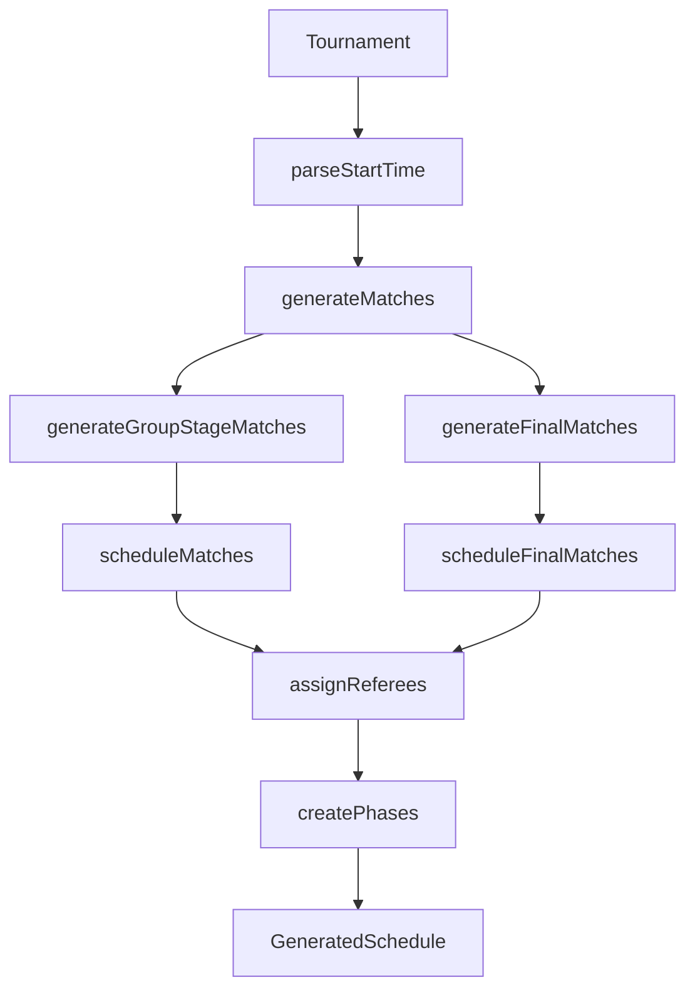
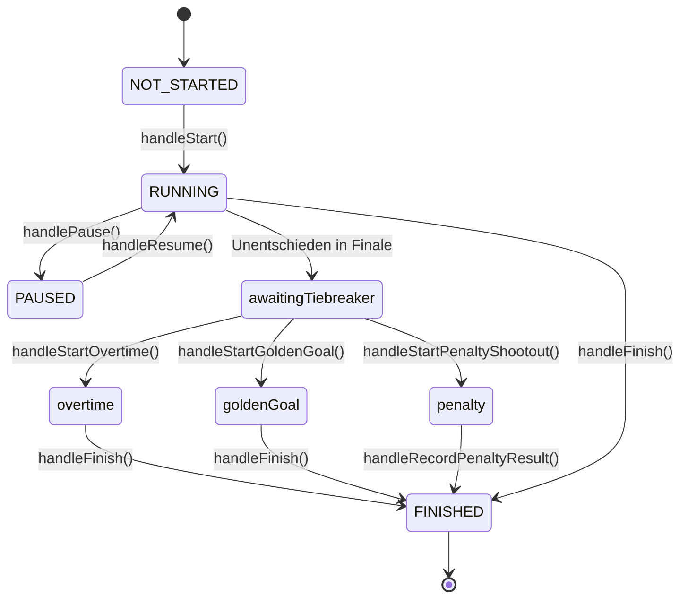

# Hallenfussball PWA - Tiefgehende Codebase-Analyse

## Übersicht der Module

| Modul | Datei | Zeilen | Funktionen | Komplexität |
|-------|-------|--------|------------|-------------|
| Tournament Wizard | `useTournamentWizard.ts` | 567 | 15 | Mittel |
| Live Match Management | `useLiveMatchManagement.ts` | 1390 | 35+ | **Hoch** |
| Fair Scheduler | `fairScheduler.ts` | 730 | 12 | Hoch |
| Playoff Resolver | `playoffResolver.ts` | 627 | 15 | Hoch |
| Schedule Generator | `scheduleGenerator.ts` | 340 | 8 | Mittel |

---

## 1. Tournament Wizard (`useTournamentWizard.ts`)

### Wizard Steps

| Step | Name | Datenfelder |
|------|------|-------------|
| 1 | Sport & Type | `sport`, `sportId`, `tournamentType` |
| 2 | Mode & System | `mode`, `groupSystem`, `numberOfFields`, `groupPhaseGameDuration`, `breakDuration`, `finalsConfig`, `refereeConfig` |
| 3 | Metadata | `title`, `date`, `timeSlot`, `location`, `ageClass`, `organizer` |
| 4 | Groups & Fields | `numberOfTeams`, `numberOfGroups`, `groups[]`, `fields[]` |
| 5 | Teams | `teams[]` (Namen, Gruppen-Zuordnung) |
| 6 | Referees | `refereeConfig.numberOfReferees`, `refereeConfig.refereeNames` |
| 7 | Preview | Finales Turnier-Objekt erstellen |

### Kern-Funktionen

```typescript
// Default-Werte für neues Turnier
getDefaultFormData(): Partial<Tournament>

// Erstellt fertiges Tournament-Objekt für Publish
createDraftTournament(): Tournament {
  - Generiert `id` via `generateTournamentId()`
  - Setzt `status: 'draft'`
  - Erstellt `createdAt`, `updatedAt`
  - MERKE: matches[] wird erst bei Publish generiert!
}

// Validierung pro Step
validateStep(stepNumber): string[] {
  Step 1: title, date, location erforderlich
  Step 2: sport, tournamentType erforderlich
  Step 3: mode erforderlich
  Step 4: Feld/Gruppen-Namen müssen eindeutig sein
  Step 5: Min. 2 Teams, Namen eindeutig
}
```

---

## 2. Schedule Generator (`scheduleGenerator.ts`)

### Haupt-Funktion

```typescript
generateFullSchedule(tournament, locale): GeneratedSchedule
```

### Ablauf



### Datenfluss

| Input | Verarbeitung | Output |
|-------|--------------|--------|
| `tournament.teams` | → `generateGroupPhaseSchedule()` | `Match[]` mit `id`, `slot`, `field`, `teamA`, `teamB` |
| `tournament.finalsConfig` | → `generatePlayoffDefinitions()` | Playoff-Bracket-Struktur |
| `Match[]` | → `scheduleMatches()` | `ScheduledMatch[]` mit `scheduledTime`, `endTime`, `matchNumber` |

### Kritische Felder die generiert werden

| Feld | Erstellt von | Wann |
|------|--------------|------|
| `match.id` | `generateGroupStageMatchId()` | Gruppenphase |
| `match.slot` | `fairScheduler` | Generierung |
| `match.scheduledTime` | `scheduleMatches()` | Generierung |
| `match.matchNumber` | `scheduleMatches()` | Generierung |
| `match.referee` | `assignReferees()` | Optional |

---

## 3. Fair Scheduler (`fairScheduler.ts`)

### Algorithmus: Circle Method + Fairness Heuristic

```
1. Generiere Round-Robin-Paarungen (Circle Method)
2. Für jedes Pairing:
   a. Finde optimalen Slot + Feld
   b. Berechne Fairness-Score:
      - Globale Varianz minimieren
      - Feldverteilung ausgleichen
      - Home/Away balancieren
   c. Platziere Match
3. Balance Home/Away nachträglich
```

### Zentrale Datenstrukturen

```typescript
interface TimeSlot {
  index: number;
  startTime?: Date;
  matches: Map<number, Match>; // fieldIndex → Match
}

interface TeamScheduleState {
  teamId: string;
  matchSlots: number[];        // Wann spielt das Team
  fieldCounts: Map<number, number>; // Wie oft auf welchem Feld
  lastSlot: number;            // Letzter Spielslot
  homeCount: number;           // Heimspiele
  awayCount: number;           // Auswärtsspiele
}
```

### Wichtige Funktionen

| Funktion | Zweck |
|----------|-------|
| `generateRoundRobinPairings()` | Circle Method Paarungen |
| `calculateFairnessScore()` | Bewertet Slot+Feld Kombination |
| `canTeamPlayInSlot()` | Prüft Mindest-Ruhepause |
| `balanceHomeAway()` | Tauscht Heim/Gast nach Scheduling |

---

## 4. Live Match Management (`useLiveMatchManagement.ts`)

### Status-Machine



### Timer-Persistenz (DEF-005)

```typescript
// Bei Start:
timerStartTime = new Date().toISOString()
timerElapsedSeconds = 0

// Bei Pause:
timerPausedAt = new Date().toISOString()
timerElapsedSeconds = elapsedSeconds

// Bei Resume:
timerStartTime = new Date().toISOString()
timerPausedAt = undefined

// Berechnung aktueller Zeit:
if (RUNNING && timerStartTime) {
  runtimeSeconds = (now - timerStartTime) / 1000
  total = timerElapsedSeconds + runtimeSeconds
}
```

### Event-Tracking

```typescript
interface MatchEvent {
  id: string;
  matchId: string;
  timestampSeconds: number; // Spielzeit
  type: 'GOAL' | 'CARD' | 'SUBSTITUTION' | 'FOUL' | 'STATUS_CHANGE' | 'TIME_PENALTY';
  payload: { team, delta, playerNumber, etc. };
  scoreAfter: { home, away };
}
```

### Wichtige Handler

| Handler | Schreibt auf | Persistiert |
|---------|--------------|-------------|
| `handleGoal()` | `liveMatches[id].homeScore/awayScore` | localStorage |
| `handleFinish()` | `tournament.matches[id].scoreA/scoreB/matchStatus/finishedAt` | tournament |
| `handleRecordPenaltyResult()` | `tournament.matches[id].penaltyScoreA/B/decidedBy` | tournament |

---

## 5. Playoff Resolver (`playoffResolver.ts`)

### Auflösungs-Logik

```
1. areAllGroupMatchesCompleted() → Prüft ob alle Gruppenspiele fertig
2. needsPlayoffResolution() → Prüft ob Platzhalter existieren
3. resolvePlayoffPairings() → Ersetzt Platzhalter mit Team-IDs
```

### Platzhalter-Formate

| Format | Beispiel | Auflösung |
|--------|----------|-----------|
| Gruppen-Position | `group-a-1st` | 1. Platz Gruppe A |
| Bracket-Winner | `semi1-winner` | Sieger Halbfinale 1 |
| Bracket-Loser | `semi1-loser` | Verlierer Halbfinale 1 |
| Best Second | `bestSecond` | Bester Gruppenzweiter |

---

## 6. Datenfluss: Kompletter Lifecycle

```
┌─────────────────────────────────────────────────────────────────────────┐
│ PHASE 1: CREATION (Wizard)                                              │
├─────────────────────────────────────────────────────────────────────────┤
│                                                                          │
│  Step 1-6: User Input → formData (Partial<Tournament>)                  │
│                                                                          │
│  Step 7 (Publish):                                                       │
│    createDraftTournament() → Tournament { id, status, teams[], ... }    │
│    generateFullSchedule(tournament) → matches[]                          │
│    tournament.matches = matches                                          │
│    saveTournament(tournament) → localStorage                             │
│                                                                          │
└─────────────────────────────────────────────────────────────────────────┘
                                    ↓
┌─────────────────────────────────────────────────────────────────────────┐
│ PHASE 2: EDITING (Schedule Editor)                                      │
├─────────────────────────────────────────────────────────────────────────┤
│                                                                          │
│  loadTournament(id) → tournament                                         │
│                                                                          │
│  User Drag & Drop:                                                       │
│    - Updates: match.scheduledTime, match.field                          │
│    - NICHT: match.slot (bleibt original!)                               │
│                                                                          │
│  handleTournamentUpdate(tournament) → localStorage                       │
│                                                                          │
└─────────────────────────────────────────────────────────────────────────┘
                                    ↓
┌─────────────────────────────────────────────────────────────────────────┐
│ PHASE 3: EXECUTION (Live Cockpit)                                       │
├─────────────────────────────────────────────────────────────────────────┤
│                                                                          │
│  getLiveMatchData(match) → LiveMatch (In-Memory-Copy)                   │
│                                                                          │
│  Während Spiel:                                                          │
│    liveMatches.set(id, { ...match, status, elapsedSeconds, events })   │
│    → Alle 5s: localStorage (liveMatchData_{tournamentId})              │
│                                                                          │
│  handleFinish():                                                         │
│    tournament.matches[id].scoreA = liveMatch.homeScore                  │
│    tournament.matches[id].scoreB = liveMatch.awayScore                  │
│    tournament.matches[id].matchStatus = 'finished'                      │
│    onTournamentUpdate(tournament) → localStorage                         │
│                                                                          │
│  autoResolvePlayoffsIfReady(tournament)                                  │
│    → Wenn alle Gruppenspiele fertig, Playoffs auflösen                  │
│                                                                          │
│  resolveBracketAfterPlayoffMatch(tournament)                             │
│    → Nach jedem Playoff-Spiel, nächste Runde auflösen                   │
│                                                                          │
└─────────────────────────────────────────────────────────────────────────┘
```

---

## 7. localStorage Struktur

| Key | Inhalt | Größe (typisch) |
|-----|--------|-----------------|
| `tournaments` | `Tournament[]` | 50-500 KB |
| `liveMatchData_{id}` | `Map<string, LiveMatch>` | 5-20 KB |
| `theme` | `'light' \| 'dark'` | <1 KB |
| `userProfile` | `UserProfile` | <2 KB |
| `sponsorImages_{id}` | Base64 Images | 0-5 MB |

---

## 8. Problembereiche (Priorisiert)

### 🔴 Kritisch

| Problem | Auswirkung | Lösung |
|---------|------------|--------|
| `useLiveMatchManagement` 1390 Zeilen | Unwartbar | → `MatchExecutionService` |
| Direkte localStorage-Zugriffe | Keine Abstraktion | → Repository Pattern |
| Keine Validierung am Storage | Crashes bei korrupten Daten | → Zod Schemas |

### 🟡 Mittel

| Problem | Auswirkung | Lösung |
|---------|------------|--------|
| Generator-Dateien verstreut | Schwer zu finden | → `src/core/generators/` |
| Doppelte Schedule-Logik | Inkonsistenzen möglich | → Vereinheitlichen |
| Fehlende Tests | Regressionen | → Unit Tests |

### 🟢 Niedrig

| Problem | Auswirkung | Lösung |
|---------|------------|--------|
| Magic Numbers | Schwer zu ändern | → Constants |
| Deutsche Fehlermeldungen hardcoded | i18n | → Translation Keys |

---

## 9. Empfohlene Migrationsreihenfolge

1. **`useLiveMatchManagement` → `MatchExecutionService`** (1-2 Tage)
   - Extrahiere Business-Logik aus Hook
   - Repository für LiveMatch-Persistenz
   - Timer-Logik isolieren

2. **Generator-Konsolidierung** (0.5 Tag)
   - Verschiebe nach `src/core/generators/`
   - Index-Datei für saubere Exports

3. **Zod-Validierung** (0.5 Tag)
   - Schema für Tournament
   - Schema für Match
   - Validierung bei Load/Save

4. **Schedule Editor → ScheduleService** (0.5 Tag)
   - Bereits teilweise migriert
   - Restliche Logik integrieren
