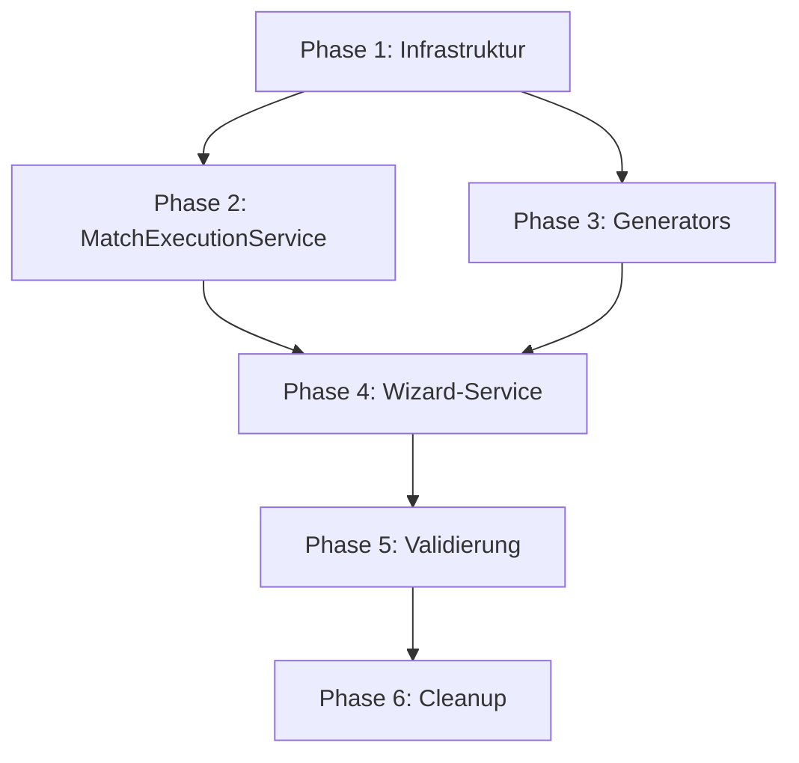

# Architektur-Migration: Vollständiger Umsetzungsplan

## Übersicht

| Phase | Beschreibung | Aufwand | Status |
|-------|--------------|---------|--------|
| 0 | Foundation (abgeschlossen) | ✅ | Done |
| 1 | Core Services Infrastruktur | 2h | Pending |
| 2 | MatchExecutionService | 4h | Pending |
| 3 | Generator-Konsolidierung | 1h | Pending |
| 4 | Wizard-Service | 2h | Pending |
| 5 | Validierung & Schemas | 2h | Pending |
| 6 | Cleanup & Testing | 2h | Pending |

**Gesamt: ~13h**

---

## Phase 1: Core Services Infrastruktur

> Ziel: Vollständige Repository- und Model-Layer aufbauen

### 1.1 Models erweitern

#### [NEW] `src/core/models/LiveMatch.ts`
```typescript
export interface LiveMatch { ... }
export interface MatchEvent { ... }
export type MatchStatus = 'NOT_STARTED' | 'RUNNING' | 'PAUSED' | 'FINISHED';
export type PlayPhase = 'regular' | 'overtime' | 'goldenGoal' | 'penalty';
```

#### [MODIFY] `src/core/models/index.ts`
- Export aller Models

---

### 1.2 Repositories erweitern

#### [NEW] `src/core/repositories/ILiveMatchRepository.ts`
```typescript
export interface ILiveMatchRepository {
  get(tournamentId: string, matchId: string): Promise<LiveMatch | null>;
  getAll(tournamentId: string): Promise<Map<string, LiveMatch>>;
  save(tournamentId: string, match: LiveMatch): Promise<void>;
  delete(tournamentId: string, matchId: string): Promise<void>;
}
```

#### [NEW] `src/core/repositories/LocalStorageLiveMatchRepository.ts`
- Implementiert `ILiveMatchRepository`
- Nutzt `liveMatchData_{tournamentId}` Key

---

## Phase 2: MatchExecutionService

> Ziel: Kernlogik aus `useLiveMatchManagement.ts` extrahieren

### 2.1 Service erstellen

#### [NEW] `src/core/services/MatchExecutionService.ts`

**Methoden zu extrahieren:**

| Aus Hook | → Service Methode |
|----------|-------------------|
| `handleStart` | `startMatch()` |
| `handlePause` | `pauseMatch()` |
| `handleResume` | `resumeMatch()` |
| `handleFinish` | `finishMatch()` |
| `handleGoal` | `recordGoal()` |
| `handleCard` | `recordCard()` |
| `handleTimePenalty` | `recordTimePenalty()` |
| `handleStartOvertime` | `startOvertime()` |
| `handleStartGoldenGoal` | `startGoldenGoal()` |
| `handleStartPenaltyShootout` | `startPenaltyShootout()` |
| `handleRecordPenaltyResult` | `recordPenaltyResult()` |
| `handleSkipMatch` | `skipMatch()` |
| `handleUnskipMatch` | `unskipMatch()` |
| `handleUndoLastEvent` | `undoLastEvent()` |
| `calculateRealTimeElapsed` | `calculateElapsedSeconds()` |
| `needsTiebreaker` | `needsTiebreaker()` |
| `isStaleMatch` (neu) | `isStaleMatch()` |

---

### 2.2 React Hook refactoren

#### [MODIFY] `src/hooks/useLiveMatchManagement.ts` → `useMatchExecution.ts`

**Vorher:** 1390 Zeilen mit Business-Logik
**Nachher:** ~200 Zeilen dünner Controller

```typescript
export function useMatchExecution(tournamentId: string) {
  const service = useMemo(() => new MatchExecutionService(...), []);
  const [matches, setMatches] = useState<Map<string, LiveMatch>>(new Map());

  // Alle Handler delegieren an Service
  const handleStart = useCallback(async (matchId: string) => {
    const updated = await service.startMatch(tournamentId, matchId);
    setMatches(prev => new Map(prev).set(matchId, updated));
  }, [service, tournamentId]);

  // ... weitere Handler

  return { matches, handleStart, handlePause, ... };
}
```

---

### 2.3 Komponenten migrieren

#### [MODIFY] `src/features/tournament-management/ManagementTab.tsx`
- Import ändern: `useLiveMatchManagement` → `useMatchExecution`

---

## Phase 3: Generator-Konsolidierung

> Ziel: Alle Generatoren in `src/core/generators/` sammeln

### 3.1 Dateien verschieben

| Von | Nach |
|-----|------|
| `src/lib/scheduleGenerator.ts` | `src/core/generators/scheduleGenerator.ts` |
| `src/lib/scheduleTypes.ts` | `src/core/generators/scheduleTypes.ts` |
| `src/lib/scheduleHelpers.ts` | `src/core/generators/scheduleHelpers.ts` |
| `src/lib/playoffGenerator.ts` | `src/core/generators/playoffGenerator.ts` |
| `src/lib/refereeAssigner.ts` | `src/core/generators/refereeAssigner.ts` |
| `src/utils/fairScheduler.ts` | `src/core/generators/fairScheduler.ts` |
| `src/utils/playoffScheduler.ts` | `src/core/generators/playoffScheduler.ts` |
| `src/utils/playoffResolver.ts` | `src/core/generators/playoffResolver.ts` |

### 3.2 Barrel Export

#### [NEW] `src/core/generators/index.ts`
```typescript
export { generateFullSchedule, GeneratedSchedule, ScheduledMatch } from './scheduleGenerator';
export { generateGroupPhaseSchedule, analyzeScheduleFairness } from './fairScheduler';
export { autoResolvePlayoffsIfReady, resolveBracketAfterPlayoffMatch } from './playoffResolver';
// etc.
```

### 3.3 Import-Pfade aktualisieren
- Alle Imports von `../lib/scheduleGenerator` → `../core/generators`
- Alle Imports von `../utils/fairScheduler` → `../core/generators`

---

## Phase 4: Wizard-Service

> Ziel: Wizard-Logik aus Hook extrahieren

### 4.1 Service erstellen

#### [NEW] `src/core/services/TournamentCreationService.ts`
```typescript
export class TournamentCreationService {
  constructor(private repository: ITournamentRepository) {}

  // Validation
  validateStep(step: number, data: Partial<Tournament>): string[]
  
  // Draft Management
  createDraft(data: Partial<Tournament>): Tournament
  saveDraft(tournament: Tournament): Promise<void>
  
  // Publish
  publish(draft: Tournament): Promise<Tournament> {
    const schedule = generateFullSchedule(draft);
    const published = { ...draft, matches: schedule.allMatches, status: 'published' };
    await this.repository.save(published);
    return published;
  }
}
```

### 4.2 Hook refactoren

#### [MODIFY] `src/hooks/useTournamentWizard.ts`
- Delegiere Validation an Service
- Delegiere Draft-Management an Service

---

## Phase 5: Validierung & Schemas

> Ziel: Daten-Integrität am Storage-Boundary sicherstellen

### 5.1 Zod Schemas

#### [NEW] `src/core/models/schemas/TournamentSchema.ts`
```typescript
import { z } from 'zod';

export const TeamSchema = z.object({
  id: z.string(),
  name: z.string().min(1),
  group: z.string().optional(),
});

export const MatchSchema = z.object({
  id: z.string(),
  teamA: z.string(),
  teamB: z.string(),
  scoreA: z.number().optional(),
  scoreB: z.number().optional(),
  // etc.
});

export const TournamentSchema = z.object({
  id: z.string(),
  title: z.string(),
  teams: z.array(TeamSchema),
  matches: z.array(MatchSchema),
  // etc.
});
```

### 5.2 Repository-Integration

#### [MODIFY] `src/core/repositories/LocalStorageRepository.ts`
```typescript
async get(id: string): Promise<Tournament | null> {
  const raw = localStorage.getItem(key);
  if (!raw) return null;
  
  const parsed = JSON.parse(raw);
  const result = TournamentSchema.safeParse(parsed);
  
  if (!result.success) {
    console.error('Invalid tournament data:', result.error);
    return null; // oder migrate(parsed)
  }
  
  return result.data;
}
```

---

## Phase 6: Cleanup & Testing

### 6.1 Dead Code entfernen

| Datei | Aktion |
|-------|--------|
| `src/lib/scheduleGenerator.ts` | Löschen (verschoben) |
| `src/lib/scheduleTypes.ts` | Löschen |
| `src/lib/scheduleHelpers.ts` | Löschen |
| `src/utils/fairScheduler.ts` | Löschen |
| `src/utils/playoffScheduler.ts` | Löschen |

### 6.2 Tests hinzufügen

#### [NEW] `src/core/services/__tests__/MatchExecutionService.test.ts`
```typescript
describe('MatchExecutionService', () => {
  it('starts a match correctly', async () => { ... });
  it('calculates elapsed time correctly', () => { ... });
  it('detects stale matches', () => { ... });
  it('handles tiebreaker flow', async () => { ... });
});
```

### 6.3 TypeScript-Check
```bash
npx tsc --noEmit
```

---

## Finale Struktur

```
src/
├── core/
│   ├── index.ts
│   ├── models/
│   │   ├── index.ts
│   │   ├── types.ts
│   │   ├── LiveMatch.ts
│   │   └── schemas/
│   │       └── TournamentSchema.ts
│   ├── repositories/
│   │   ├── index.ts
│   │   ├── ITournamentRepository.ts
│   │   ├── ILiveMatchRepository.ts
│   │   ├── LocalStorageRepository.ts
│   │   └── LocalStorageLiveMatchRepository.ts
│   ├── services/
│   │   ├── index.ts
│   │   ├── TournamentService.ts
│   │   ├── ScheduleService.ts
│   │   ├── MatchExecutionService.ts
│   │   ├── StandingsService.ts
│   │   └── TournamentCreationService.ts
│   └── generators/
│       ├── index.ts
│       ├── scheduleGenerator.ts
│       ├── scheduleTypes.ts
│       ├── scheduleHelpers.ts
│       ├── fairScheduler.ts
│       ├── playoffGenerator.ts
│       ├── playoffScheduler.ts
│       ├── playoffResolver.ts
│       └── refereeAssigner.ts
│
├── hooks/
│   ├── useTournamentManager.ts
│   ├── useScheduleManager.ts
│   ├── useMatchExecution.ts
│   └── useTournamentWizard.ts
│
└── features/ (unverändert)
```

---

## Abhängigkeiten



---

## Risiken & Mitigationen

| Risiko | Mitigation |
|--------|------------|
| Live-Spiele während Migration | Feature-Flag, schrittweise Migration |
| localStorage-Format-Änderungen | Migrations-Script schreiben |
| Breaking Changes in Hooks | Backward-compatible Wrapper |
