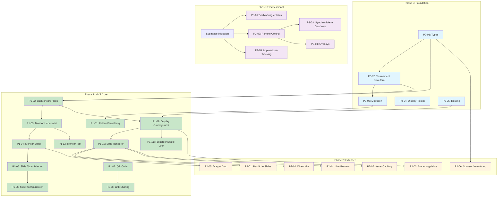

# Monitor-Konfigurator - Umsetzungsplan

> **Version:** 1.0
> **Erstellt:** 2026-01-03
> **Projekt:** Hallenfussball PWA

---

## Executive Summary

Dieser Plan beschreibt die schrittweise Implementierung des Monitor-Konfigurators in **4 Phasen**. Das System ermoeglicht Turnierveranstaltern, beliebig viele Display-Konfigurationen zu erstellen und individuell mit Inhalten zu bespielen.

### Kernumfang

| Phase | Fokus | Tasks | Geschaetzte Dauer |
|-------|-------|-------|-------------------|
| **Phase 0** | Foundation | Datenmodell, Types, Migration | 2-3 Tage |
| **Phase 1** | MVP Core | Konfigurator UI, 5 Slide-Typen, Display | 8-10 Tage |
| **Phase 2** | Extended | Restliche Slides, When Idle, Preview | 5-7 Tage |
| **Phase 3** | Professional | Remote Control, Sync, Overlays | Nach Supabase |

**Gesamt Phase 0-2: ca. 15-20 Arbeitstage**

### Kritischer Pfad

```
Types → Migration → Fields UI → Monitor CRUD → Slide Management → Display View
```

---

## Phasen-Uebersicht

```
┌─────────────────────────────────────────────────────────────────────────────┐
│ PHASE 0: FOUNDATION (2-3 Tage)                                              │
├─────────────────────────────────────────────────────────────────────────────┤
│ • TypeScript Interfaces (TournamentMonitor, MonitorSlide, etc.)             │
│ • Tournament Type erweitern (monitors[], fields[], sponsors[])              │
│ • Migration-Logik fuer bestehende Turniere                                  │
│ • Display-spezifische Design Tokens                                         │
│ • Routing vorbereiten (neue Screen-Types)                                   │
│                                                                             │
│ Meilenstein: Datenmodell komplett, Migration funktioniert                   │
└─────────────────────────────────────────────────────────────────────────────┘
                                     │
                                     ▼
┌─────────────────────────────────────────────────────────────────────────────┐
│ PHASE 1: MVP CORE (8-10 Tage)                                               │
├─────────────────────────────────────────────────────────────────────────────┤
│ • Felder-Verwaltung (Einstellungen → Felder)                                │
│ • Monitor-Konfigurator UI (Reiter "Monitore")                               │
│ • Monitor CRUD (erstellen, bearbeiten, loeschen)                            │
│ • Slide-Management (hinzufuegen, sortieren, loeschen)                       │
│ • 5 Basis-Slide-Typen: Live, Standings, Schedule-Field, Sponsor, Custom     │
│ • Display-Ansicht mit Slideshow-Logik                                       │
│ • Fullscreen + Wake Lock                                                    │
│ • QR-Code Generierung + Link-Sharing                                        │
│                                                                             │
│ Meilenstein: Funktionierender Monitor von Konfiguration bis Display         │
└─────────────────────────────────────────────────────────────────────────────┘
                                     │
                                     ▼
┌─────────────────────────────────────────────────────────────────────────────┐
│ PHASE 2: EXTENDED (5-7 Tage)                                                │
├─────────────────────────────────────────────────────────────────────────────┤
│ • Restliche Slide-Typen: All-Standings, Schedule-Group, Next-Matches,       │
│   Top-Scorers                                                               │
│ • When Idle Logik (fuer Live-Slides)                                        │
│ • Versteckte Steuerungsleiste                                               │
│ • Live-Preview im Konfigurator                                              │
│ • Drag & Drop fuer Slides                                                   │
│ • Sponsor-Verwaltung (eigener Bereich unter Einstellungen)                  │
│ • Asset-Caching (Service Worker)                                            │
│                                                                             │
│ Meilenstein: Professionelle UX mit allen Slide-Typen                        │
└─────────────────────────────────────────────────────────────────────────────┘
                                     │
                                     ▼
┌─────────────────────────────────────────────────────────────────────────────┐
│ PHASE 3: PROFESSIONAL (Nach Supabase-Migration)                             │
├─────────────────────────────────────────────────────────────────────────────┤
│ • Verbindungs-Status ("X Geraete online")                                   │
│ • Remote Control (alle Monitore gleichzeitig steuern)                       │
│ • Synchronisierte Diashows zwischen Monitoren                               │
│ • Overlays (Tor-Animation, Ticker)                                          │
│ • Impressions-Tracking fuer Sponsoren                                       │
│                                                                             │
│ Meilenstein: Enterprise-Features fuer grosse Events                         │
└─────────────────────────────────────────────────────────────────────────────┘
```

---

## Phase 0: Foundation

### P0-01: TypeScript Interfaces definieren

**Beschreibung:** Alle neuen Types fuer Monitor-Konfigurator erstellen

**Abhaengigkeiten:** Keine

**Betroffene Dateien:**
- `src/types/tournament.ts` (erweitern)
- `src/types/monitor.ts` (neu)

**Komplexitaet:** Mittel

**Geschaetzter Aufwand:** 4 Stunden

**Akzeptanzkriterien:**
- [ ] `TournamentField` Interface mit id, name, shortName, order
- [ ] `Sponsor` Interface mit id, name, logoUrl, websiteUrl, tier
- [ ] `TournamentMonitor` Interface mit id, name, slides[], settings
- [ ] `MonitorSlide` Interface mit id, type, config, duration, order
- [ ] `SlideConfig` Union Type fuer alle 9 Slide-Typen
- [ ] `SlideType` Literal Union
- [ ] `TransitionType` ('fade' | 'slide' | 'none')
- [ ] `WhenIdleConfig` und `WhenIdleType`
- [ ] `QrTargetType` ('tournament' | 'sponsor-website' | 'custom')
- [ ] Default-Wert Konstanten exportiert

**Code-Beispiel:**

```typescript
// src/types/monitor.ts

export interface TournamentField {
  id: string;
  name: string;
  shortName?: string;
  order: number;
}

export interface Sponsor {
  id: string;
  name: string;
  logoUrl?: string;
  websiteUrl?: string;
  tier?: 'gold' | 'silver' | 'bronze';
}

export interface TournamentMonitor {
  id: string;
  name: string;
  defaultSlideDuration: number;
  transition: TransitionType;
  transitionDuration: number;
  slides: MonitorSlide[];
  createdAt: string;
  updatedAt: string;
}

export type TransitionType = 'fade' | 'slide' | 'none';

export type SlideType =
  | 'live'
  | 'standings'
  | 'all-standings'
  | 'schedule-group'
  | 'schedule-field'
  | 'next-matches'
  | 'top-scorers'
  | 'sponsor'
  | 'custom-text';

export interface MonitorSlide {
  id: string;
  type: SlideType;
  config: SlideConfig;
  duration: number | null;
  order: number;
}

// ... weitere Types
```

---

### P0-02: Tournament Type erweitern

**Beschreibung:** Bestehenden Tournament Type um monitors[], fields[], sponsors[] erweitern

**Abhaengigkeiten:** P0-01

**Betroffene Dateien:**
- `src/types/tournament.ts`

**Komplexitaet:** Niedrig

**Geschaetzter Aufwand:** 1 Stunde

**Akzeptanzkriterien:**
- [ ] `Tournament` Interface hat optionale `monitors: TournamentMonitor[]`
- [ ] `Tournament` Interface hat optionale `fields: TournamentField[]`
- [ ] `Tournament` Interface hat optionale `sponsors: Sponsor[]`
- [ ] Bestehende `numberOfFields` in Settings bleibt fuer Rueckwaertskompatibilitaet
- [ ] TypeScript Build laeuft ohne Fehler

---

### P0-03: Migration-Logik implementieren

**Beschreibung:** Automatische Migration bestehender Turniere ohne fields[] Array

**Abhaengigkeiten:** P0-02

**Betroffene Dateien:**
- `src/utils/tournamentMigration.ts` (neu)
- `src/hooks/useTournaments.ts` (erweitern)

**Komplexitaet:** Mittel

**Geschaetzter Aufwand:** 3 Stunden

**Akzeptanzkriterien:**
- [ ] `migrateTournamentFields()` Funktion erstellt
- [ ] Migration wird beim Laden eines Turniers automatisch ausgefuehrt
- [ ] Bestehende `numberOfFields` Setting wird in `fields[]` konvertiert
- [ ] Default-Namen: "Hauptfeld", "Feld 2", "Feld 3", etc.
- [ ] Migration ist idempotent (mehrfaches Ausfuehren aendert nichts)
- [ ] Unit Tests fuer Migration

**Code-Beispiel:**

```typescript
// src/utils/tournamentMigration.ts

import { Tournament, TournamentField } from '@/types/tournament';
import { generateId } from '@/utils/idGenerator';

export function migrateTournamentFields(tournament: Tournament): Tournament {
  // Bereits migriert?
  if (tournament.fields && tournament.fields.length > 0) {
    return tournament;
  }

  const numberOfFields = tournament.settings?.numberOfFields || 2;

  const fields: TournamentField[] = Array.from(
    { length: numberOfFields },
    (_, i) => ({
      id: generateId(),
      name: i === 0 ? 'Hauptfeld' : `Feld ${i + 1}`,
      shortName: `F${i + 1}`,
      order: i
    })
  );

  return {
    ...tournament,
    fields
  };
}
```

---

### P0-04: Display Design Tokens

**Beschreibung:** TV/Monitor-optimierte Design Tokens hinzufuegen

**Abhaengigkeiten:** Keine

**Betroffene Dateien:**
- `src/design-tokens/display.ts` (neu)
- `src/design-tokens/index.ts` (erweitern)

**Komplexitaet:** Niedrig

**Geschaetzter Aufwand:** 2 Stunden

**Akzeptanzkriterien:**
- [ ] `displayTokens` Objekt mit TV-optimierten Werten
- [ ] Grosse Schriftgroessen (Score: 120px, Timer: 64px, etc.)
- [ ] Hoher Kontrast fuer helle Sporthallen
- [ ] Smooth Transition-Werte
- [ ] TV-optimiertes Spacing (Overscan beruecksichtigt)
- [ ] Steuerungsleisten-Werte (height, background, buttonSize)
- [ ] Export in design-tokens/index.ts

---

### P0-05: Routing vorbereiten

**Beschreibung:** Neue Screen-Types fuer Monitor-Konfigurator und Display-Ansicht

**Abhaengigkeiten:** Keine

**Betroffene Dateien:**
- `src/App.tsx`
- `src/screens/` (Platzhalter-Screens)

**Komplexitaet:** Niedrig

**Geschaetzter Aufwand:** 2 Stunden

**Akzeptanzkriterien:**
- [ ] Neuer ScreenType: 'monitor-display'
- [ ] URL-Parsing fuer `/t/:tournamentId/monitor/:monitorId`
- [ ] URL-Parsing fuer `/t/:tournamentId/monitors` (Konfigurator)
- [ ] Lazy-Loading vorbereitet fuer MonitorDisplayScreen
- [ ] Platzhalter-Komponenten ohne Funktionalitaet

---

## Phase 1: MVP Core

### P1-01: Felder-Verwaltung UI

**Beschreibung:** Neuer Bereich unter Einstellungen zum Verwalten von Spielfeldern

**Abhaengigkeiten:** P0-03

**Betroffene Dateien:**
- `src/features/tournament-management/components/SettingsTab/FieldManagement.tsx` (neu)
- `src/features/tournament-management/SettingsTab.tsx` (erweitern)

**Komplexitaet:** Mittel

**Geschaetzter Aufwand:** 4 Stunden

**Akzeptanzkriterien:**
- [ ] Liste aller Felder mit Name, KurzName, Spielanzahl
- [ ] Feld hinzufuegen Button
- [ ] Feld bearbeiten (Name aendern)
- [ ] Feld loeschen (mit Warnung wenn Spiele zugewiesen)
- [ ] Drag & Drop zum Sortieren
- [ ] Validierung: Mindestens 1 Feld
- [ ] Hinweis-Box: "Spielplan muss neu generiert werden"

---

### P1-02: useMonitors Hook

**Beschreibung:** Custom Hook fuer Monitor-CRUD Operationen

**Abhaengigkeiten:** P0-01, P0-02

**Betroffene Dateien:**
- `src/hooks/useMonitors.ts` (neu)
- `src/hooks/index.ts` (erweitern)

**Komplexitaet:** Mittel

**Geschaetzter Aufwand:** 4 Stunden

**Akzeptanzkriterien:**
- [ ] `useMonitors(tournamentId)` Hook
- [ ] CRUD: create, read, update, delete Monitor
- [ ] Slide-Operationen: add, remove, reorder Slides
- [ ] Optimistisches Update mit Rollback bei Fehler
- [ ] localStorage Persistenz
- [ ] Cross-Tab Sync via `useMultiTabSync`
- [ ] TypeScript typisiert

**Code-Beispiel:**

```typescript
// src/hooks/useMonitors.ts

interface UseMonitorsReturn {
  monitors: TournamentMonitor[];
  isLoading: boolean;

  // Monitor CRUD
  createMonitor: (name: string) => TournamentMonitor;
  updateMonitor: (id: string, updates: Partial<TournamentMonitor>) => void;
  deleteMonitor: (id: string) => void;
  duplicateMonitor: (id: string) => TournamentMonitor;

  // Slide Operations
  addSlide: (monitorId: string, slide: Omit<MonitorSlide, 'id' | 'order'>) => void;
  updateSlide: (monitorId: string, slideId: string, updates: Partial<MonitorSlide>) => void;
  removeSlide: (monitorId: string, slideId: string) => void;
  reorderSlides: (monitorId: string, fromIndex: number, toIndex: number) => void;

  // Helpers
  getMonitorUrl: (monitorId: string) => string;
  createDefaultMonitor: () => TournamentMonitor;
}

export function useMonitors(tournamentId: string): UseMonitorsReturn {
  // Implementation
}
```

---

### P1-03: Monitor-Konfigurator UI - Uebersicht

**Beschreibung:** Hauptansicht des Monitor-Konfigurators mit Liste aller Monitore

**Abhaengigkeiten:** P1-02

**Betroffene Dateien:**
- `src/features/monitor-configurator/MonitorConfiguratorPage.tsx` (neu)
- `src/features/monitor-configurator/components/MonitorList.tsx` (neu)
- `src/features/monitor-configurator/components/MonitorCard.tsx` (neu)
- `src/features/monitor-configurator/index.ts` (neu)

**Komplexitaet:** Mittel

**Geschaetzter Aufwand:** 5 Stunden

**Akzeptanzkriterien:**
- [ ] Responsive Grid-Ansicht aller Monitore
- [ ] MonitorCard zeigt: Name, Slide-Anzahl, Intervall, Mini-Vorschau
- [ ] Quick-Actions: Bearbeiten, Link, QR-Code, Vorschau, Loeschen
- [ ] "Neuen Monitor anlegen" Button
- [ ] "Standard-Monitor erstellen" Schnellstart
- [ ] Leerzustand wenn keine Monitore
- [ ] Hilfe-Button mit Erklaerung

---

### P1-04: Monitor Editor Dialog

**Beschreibung:** Fullscreen-Dialog zum Bearbeiten eines Monitors

**Abhaengigkeiten:** P1-03

**Betroffene Dateien:**
- `src/features/monitor-configurator/components/MonitorEditor.tsx` (neu)
- `src/features/monitor-configurator/components/SlideList.tsx` (neu)
- `src/features/monitor-configurator/components/SlideCard.tsx` (neu)

**Komplexitaet:** Hoch

**Geschaetzter Aufwand:** 6 Stunden

**Akzeptanzkriterien:**
- [ ] Name, Standard-Dauer, Uebergangs-Einstellungen
- [ ] Slide-Liste mit Drag & Drop zum Sortieren
- [ ] SlideCard zeigt: Typ-Icon, Titel, Dauer, Aktionen
- [ ] "Slide hinzufuegen" Button
- [ ] Speichern/Abbrechen Buttons
- [ ] Unsaved-Changes Warnung

---

### P1-05: Slide Type Selector

**Beschreibung:** Dialog zur Auswahl des Slide-Typs beim Hinzufuegen

**Abhaengigkeiten:** P1-04

**Betroffene Dateien:**
- `src/features/monitor-configurator/components/SlideTypeSelector.tsx` (neu)

**Komplexitaet:** Niedrig

**Geschaetzter Aufwand:** 2 Stunden

**Akzeptanzkriterien:**
- [ ] Kategorisierte Auswahl (Live & Spielplan, Tabellen & Statistik, Sponsor & Sonstiges)
- [ ] Icon + Titel + Beschreibung pro Typ
- [ ] Klick oeffnet typ-spezifischen Konfigurator
- [ ] Responsive Grid-Layout
- [ ] Schliessen-Button

---

### P1-06: Slide Konfiguratoren - Basis

**Beschreibung:** Konfigurationsdialoge fuer die 5 Basis-Slide-Typen

**Abhaengigkeiten:** P1-05

**Betroffene Dateien:**
- `src/features/monitor-configurator/components/SlideConfigurators/LiveSlideConfig.tsx` (neu)
- `src/features/monitor-configurator/components/SlideConfigurators/StandingsSlideConfig.tsx` (neu)
- `src/features/monitor-configurator/components/SlideConfigurators/ScheduleFieldSlideConfig.tsx` (neu)
- `src/features/monitor-configurator/components/SlideConfigurators/SponsorSlideConfig.tsx` (neu)
- `src/features/monitor-configurator/components/SlideConfigurators/CustomTextSlideConfig.tsx` (neu)
- `src/features/monitor-configurator/components/SlideConfigurators/index.ts` (neu)

**Komplexitaet:** Mittel

**Geschaetzter Aufwand:** 8 Stunden (je ~1.5h pro Typ)

**Akzeptanzkriterien:**

**LiveSlideConfig:**
- [ ] Feld-Auswahl Dropdown
- [ ] "Diashow pausieren waehrend Spiel laeuft" Checkbox
- [ ] When Idle Optionen (vorerst nur 'skip')
- [ ] Eigene Dauer oder Standard

**StandingsSlideConfig:**
- [ ] Gruppe-Auswahl Dropdown
- [ ] Eigene Dauer oder Standard

**ScheduleFieldSlideConfig:**
- [ ] Feld-Auswahl Dropdown
- [ ] Eigene Dauer oder Standard

**SponsorSlideConfig:**
- [ ] Sponsor-Auswahl oder "Neu anlegen"
- [ ] Inline Sponsor-Erstellung (Name, Logo-URL, Website)
- [ ] QR-Code Ziel Optionen
- [ ] "QR-Code anzeigen" Checkbox
- [ ] Eigene Dauer oder Standard

**CustomTextSlideConfig:**
- [ ] Headline Input
- [ ] Body Textarea
- [ ] Text-Ausrichtung (left/center/right)
- [ ] Hintergrundfarbe (optional)
- [ ] Eigene Dauer oder Standard

---

### P1-07: QR-Code Generierung

**Beschreibung:** QR-Code Generierung fuer Monitor-Links und Sponsor-URLs

**Abhaengigkeiten:** Keine

**Betroffene Dateien:**
- `src/utils/qrCodeGenerator.ts` (neu)
- `src/features/monitor-configurator/components/QRCodeDialog.tsx` (neu)

**Komplexitaet:** Niedrig

**Geschaetzter Aufwand:** 3 Stunden

**Akzeptanzkriterien:**
- [ ] QR-Code Generierung mit `qrcode` Library
- [ ] Einstellbare Groesse (S/M/L)
- [ ] Download als PNG
- [ ] Drucken-Funktion
- [ ] Dialog zeigt QR-Code + URL

---

### P1-08: Link-Sharing Komponente

**Beschreibung:** UI zum Teilen von Monitor-Links

**Abhaengigkeiten:** P1-07

**Betroffene Dateien:**
- `src/features/monitor-configurator/components/ShareMonitorDialog.tsx` (neu)

**Komplexitaet:** Niedrig

**Geschaetzter Aufwand:** 2 Stunden

**Akzeptanzkriterien:**
- [ ] Link-Anzeige mit Copy-Button
- [ ] QR-Code Button (oeffnet QRCodeDialog)
- [ ] "Im neuen Tab oeffnen" Button
- [ ] Hinweis: "Link oeffnet automatisch im Vollbildmodus"

---

### P1-09: Display-Ansicht - Grundgeruest

**Beschreibung:** Oeffentliche Display-Seite mit Slideshow-Engine

**Abhaengigkeiten:** P0-05, P1-02

**Betroffene Dateien:**
- `src/features/monitor-display/MonitorDisplayPage.tsx` (neu)
- `src/features/monitor-display/hooks/useSlideshow.ts` (neu)
- `src/features/monitor-display/components/TransitionWrapper.tsx` (neu)

**Komplexitaet:** Hoch

**Geschaetzter Aufwand:** 6 Stunden

**Akzeptanzkriterien:**
- [ ] Laedt Monitor-Konfiguration anhand URL
- [ ] Slideshow-Timer mit konfigurierbarem Intervall
- [ ] Smooth Transitions zwischen Slides (fade/slide/none)
- [ ] Aktueller Slide-Index State
- [ ] Pause/Resume Funktionalitaet
- [ ] Next/Previous Navigation

**Code-Beispiel:**

```typescript
// src/features/monitor-display/hooks/useSlideshow.ts

interface UseSlideshowReturn {
  currentSlide: MonitorSlide;
  currentIndex: number;
  totalSlides: number;
  timeRemaining: number;
  isPaused: boolean;
  isTransitioning: boolean;

  nextSlide: () => void;
  prevSlide: () => void;
  goToSlide: (index: number) => void;
  togglePause: () => void;
}

export function useSlideshow(
  monitor: TournamentMonitor,
  tournament: Tournament
): UseSlideshowReturn {
  // Implementation mit useEffect fuer Timer
}
```

---

### P1-10: Slide Renderer

**Beschreibung:** Komponente die den richtigen Slide-Typ rendert

**Abhaengigkeiten:** P1-09

**Betroffene Dateien:**
- `src/features/monitor-display/components/SlideRenderer.tsx` (neu)
- `src/features/monitor-display/components/slides/LiveSlide.tsx` (neu)
- `src/features/monitor-display/components/slides/StandingsSlide.tsx` (neu)
- `src/features/monitor-display/components/slides/ScheduleFieldSlide.tsx` (neu)
- `src/features/monitor-display/components/slides/SponsorSlide.tsx` (neu)
- `src/features/monitor-display/components/slides/CustomTextSlide.tsx` (neu)
- `src/features/monitor-display/components/slides/index.ts` (neu)

**Komplexitaet:** Hoch

**Geschaetzter Aufwand:** 10 Stunden (je ~2h pro Slide-Typ)

**Akzeptanzkriterien:**

**SlideRenderer:**
- [ ] Switch-Case fuer alle Slide-Typen
- [ ] Props: slide, tournament, transition state
- [ ] Fallback fuer unbekannte Typen

**LiveSlide:**
- [ ] Zeigt aktuelles Spiel auf konfiguriertem Feld
- [ ] Nutzt bestehende LiveMatchDisplay Komponente
- [ ] Zeigt NoMatchDisplay wenn kein Spiel laeuft

**StandingsSlide:**
- [ ] Zeigt Tabelle der konfigurierten Gruppe
- [ ] Nutzt bestehende GroupTables Komponente
- [ ] TV-optimiertes Styling

**ScheduleFieldSlide:**
- [ ] Zeigt Spielplan des konfigurierten Felds
- [ ] Hervorgehobenes aktuelles/naechstes Spiel
- [ ] Auto-Scroll zum relevanten Spiel

**SponsorSlide:**
- [ ] Zeigt Sponsor-Logo gross zentriert
- [ ] QR-Code wenn konfiguriert
- [ ] Fallback zu Text wenn kein Logo

**CustomTextSlide:**
- [ ] Headline + Body Text
- [ ] Konfigurierte Ausrichtung
- [ ] Konfigurierte Hintergrundfarbe

---

### P1-11: Fullscreen + Wake Lock

**Beschreibung:** Automatischer Fullscreen und Screen Wake Lock

**Abhaengigkeiten:** P1-09

**Betroffene Dateien:**
- `src/features/monitor-display/hooks/useFullscreen.ts` (erweitern oder neu)
- `src/features/monitor-display/hooks/useWakeLock.ts` (neu)

**Komplexitaet:** Mittel

**Geschaetzter Aufwand:** 3 Stunden

**Akzeptanzkriterien:**
- [ ] Auto-Fullscreen bei Seitenaufruf (ausser `?fullscreen=false`)
- [ ] Wake Lock API um Display aktiv zu halten
- [ ] Re-acquire Wake Lock bei visibility change
- [ ] Graceful Fallback wenn APIs nicht verfuegbar
- [ ] Keyboard Shortcuts (F, F11, Escape)

---

### P1-12: Monitor-Reiter im Tournament Dashboard

**Beschreibung:** Integration des Monitor-Konfigurators ins Turnier-Dashboard

**Abhaengigkeiten:** P1-03

**Betroffene Dateien:**
- `src/features/tournament-management/TournamentManagementScreen.tsx`
- `src/features/tournament-management/MonitorConfigTab.tsx` (neu)

**Komplexitaet:** Niedrig

**Geschaetzter Aufwand:** 2 Stunden

**Akzeptanzkriterien:**
- [ ] Neuer Tab "Monitore" im Turnier-Dashboard
- [ ] Tab zeigt MonitorConfiguratorPage eingebettet
- [ ] Tab-Icon (TV/Monitor Symbol)
- [ ] Badge mit Monitor-Anzahl (optional)

---

## Phase 2: Extended

### P2-01: Restliche Slide-Typen

**Beschreibung:** Implementierung der verbleibenden 4 Slide-Typen

**Abhaengigkeiten:** P1-10

**Betroffene Dateien:**
- `src/features/monitor-configurator/components/SlideConfigurators/AllStandingsSlideConfig.tsx` (neu)
- `src/features/monitor-configurator/components/SlideConfigurators/ScheduleGroupSlideConfig.tsx` (neu)
- `src/features/monitor-configurator/components/SlideConfigurators/NextMatchesSlideConfig.tsx` (neu)
- `src/features/monitor-configurator/components/SlideConfigurators/TopScorersSlideConfig.tsx` (neu)
- `src/features/monitor-display/components/slides/AllStandingsSlide.tsx` (neu)
- `src/features/monitor-display/components/slides/ScheduleGroupSlide.tsx` (neu)
- `src/features/monitor-display/components/slides/NextMatchesSlide.tsx` (neu)
- `src/features/monitor-display/components/slides/TopScorersSlide.tsx` (neu)

**Komplexitaet:** Mittel

**Geschaetzter Aufwand:** 8 Stunden

**Akzeptanzkriterien:**

**AllStandingsSlide:**
- [ ] Grid-Layout aller Gruppen-Tabellen
- [ ] Responsive: 2 Spalten Desktop, 1 Spalte Mobile
- [ ] Kompakte Tabellenansicht

**ScheduleGroupSlide:**
- [ ] Spielplan einer Gruppe
- [ ] Ergebnisse + kommende Spiele

**NextMatchesSlide:**
- [ ] Konfigurierbare Anzahl (1-10)
- [ ] Countdown zum naechsten Spiel
- [ ] Feld-Anzeige

**TopScorersSlide:**
- [ ] Top 10 Torschuetzen
- [ ] Team-Logo, Name, Tore

---

### P2-02: When Idle Logik

**Beschreibung:** Intelligentes Verhalten fuer Live-Slides wenn kein Spiel laeuft

**Abhaengigkeiten:** P1-10

**Betroffene Dateien:**
- `src/features/monitor-display/components/IdleContent.tsx` (neu)
- `src/features/monitor-display/hooks/useSlideshow.ts` (erweitern)
- `src/features/monitor-display/components/slides/LiveSlide.tsx` (erweitern)

**Komplexitaet:** Mittel

**Geschaetzter Aufwand:** 5 Stunden

**Akzeptanzkriterien:**
- [ ] When Idle Typen: next-match, last-result, top-scorers, sponsor, skip
- [ ] "Naechstes Spiel" mit Countdown-Timer
- [ ] "Letztes Ergebnis" mit Torschuetzen (wenn verfuegbar)
- [ ] Timeout-Option: Nach X Sekunden trotzdem weiter
- [ ] Slideshow-Pause waehrend laufendem Spiel

---

### P2-03: Versteckte Steuerungsleiste

**Beschreibung:** Overlay-Steuerung die bei Interaktion erscheint

**Abhaengigkeiten:** P1-09

**Betroffene Dateien:**
- `src/features/monitor-display/components/DisplayControls.tsx` (neu)
- `src/features/monitor-display/hooks/useIdleDetection.ts` (neu)

**Komplexitaet:** Mittel

**Geschaetzter Aufwand:** 4 Stunden

**Akzeptanzkriterien:**
- [ ] Erscheint bei Mausbewegung oder Touch
- [ ] Verschwindet nach 3 Sekunden Inaktivitaet
- [ ] Zeigt: Monitor-Name, Slide X von Y, Zeit bis Wechsel
- [ ] Buttons: Zurueck, Pause/Play, Weiter, Vollbild
- [ ] Keyboard-Shortcuts funktionieren
- [ ] Smooth Fade-Animation

---

### P2-04: Live-Preview im Konfigurator

**Beschreibung:** Echtzeit-Miniatur des Monitors im Editor

**Abhaengigkeiten:** P1-10

**Betroffene Dateien:**
- `src/features/monitor-configurator/components/MonitorPreview.tsx` (neu)
- `src/features/monitor-configurator/hooks/useMonitorPreview.ts` (neu)

**Komplexitaet:** Mittel

**Geschaetzter Aufwand:** 5 Stunden

**Akzeptanzkriterien:**
- [ ] Skalierte Echtzeit-Vorschau
- [ ] Zeigt aktuellen Slide mit Timer
- [ ] Play/Pause Controls
- [ ] Slide-Indikator
- [ ] Click-to-Jump zu Slide

---

### P2-05: Drag & Drop fuer Slides

**Beschreibung:** Erweiterte Slide-Sortierung mit Drag & Drop

**Abhaengigkeiten:** P1-04

**Betroffene Dateien:**
- `src/features/monitor-configurator/components/SlideList.tsx` (erweitern)
- `src/features/monitor-configurator/hooks/useSlideDragDrop.ts` (neu)

**Komplexitaet:** Mittel

**Geschaetzter Aufwand:** 4 Stunden

**Akzeptanzkriterien:**
- [ ] Native HTML5 Drag & Drop
- [ ] Visual Feedback waehrend Drag
- [ ] Drop-Zone Highlighting
- [ ] Keyboard Accessibility (Alt+Up/Down)
- [ ] Mobile Touch-Drag Support

---

### P2-06: Sponsor-Verwaltung

**Beschreibung:** Eigener Bereich zur Verwaltung von Sponsoren

**Abhaengigkeiten:** P0-01

**Betroffene Dateien:**
- `src/features/tournament-management/components/SettingsTab/SponsorManagement.tsx` (neu)
- `src/hooks/useSponsors.ts` (neu)

**Komplexitaet:** Mittel

**Geschaetzter Aufwand:** 5 Stunden

**Akzeptanzkriterien:**
- [ ] Liste aller Sponsoren
- [ ] CRUD Operationen
- [ ] Logo-Upload (Base64 fuer Phase 1)
- [ ] Tier-Zuweisung (Gold/Silver/Bronze)
- [ ] Drag & Drop Sortierung

---

### P2-07: Asset-Caching (Service Worker)

**Beschreibung:** Offline-Caching fuer stabile Anzeige bei schlechtem WLAN

**Abhaengigkeiten:** P1-10

**Betroffene Dateien:**
- `src/service-worker.ts` (erweitern)
- `src/features/monitor-display/MonitorDisplayPage.tsx` (erweitern)

**Komplexitaet:** Hoch

**Geschaetzter Aufwand:** 6 Stunden

**Akzeptanzkriterien:**
- [ ] Sponsor-Logos werden gecacht
- [ ] Team-Logos werden gecacht
- [ ] Turnier-Daten werden gecacht
- [ ] Background Sync fuer Updates
- [ ] Cache-Invalidierung bei Aenderungen
- [ ] Offline-Indikator in Display

---

## Phase 3: Professional (Nach Supabase)

### P3-01: Verbindungs-Status

**Beschreibung:** Anzeige wie viele Geraete einen Monitor anzeigen

**Abhaengigkeiten:** Supabase Realtime

**Betroffene Dateien:**
- `src/features/monitor-configurator/components/MonitorCard.tsx` (erweitern)
- `src/hooks/useMonitorPresence.ts` (neu)

**Komplexitaet:** Mittel

**Geschaetzter Aufwand:** 4 Stunden

**Akzeptanzkriterien:**
- [ ] "X Geraete online" Badge
- [ ] Realtime Updates via Supabase Presence
- [ ] Geraete-Liste bei Hover

---

### P3-02: Remote Control

**Beschreibung:** Fernsteuerung aller Monitore vom Dashboard aus

**Abhaengigkeiten:** Supabase Realtime

**Betroffene Dateien:**
- `src/features/monitor-configurator/components/RemoteControlPanel.tsx` (neu)
- `src/hooks/useMonitorRemote.ts` (neu)

**Komplexitaet:** Hoch

**Geschaetzter Aufwand:** 8 Stunden

**Akzeptanzkriterien:**
- [ ] Alle Monitore auf bestimmten Slide schalten
- [ ] Alle Monitore pausieren/fortsetzen
- [ ] Notfall-Nachricht an alle senden
- [ ] Realtime Sync via Supabase Broadcast

---

### P3-03: Synchronisierte Diashows

**Beschreibung:** Mehrere Monitore zeigen gleichen Slide zur gleichen Zeit

**Abhaengigkeiten:** P3-02

**Betroffene Dateien:**
- `src/features/monitor-display/hooks/useSlideshowSync.ts` (neu)

**Komplexitaet:** Hoch

**Geschaetzter Aufwand:** 6 Stunden

**Akzeptanzkriterien:**
- [ ] Master-Clock fuer alle Monitore
- [ ] Sync-Gruppe konfigurierbar
- [ ] Drift-Korrektur
- [ ] Graceful Fallback bei Disconnect

---

### P3-04: Overlays

**Beschreibung:** Tor-Animationen und Ticker-Einblendungen

**Abhaengigkeiten:** P3-02

**Betroffene Dateien:**
- `src/features/monitor-display/components/overlays/GoalOverlay.tsx` (neu)
- `src/features/monitor-display/components/overlays/TickerOverlay.tsx` (neu)

**Komplexitaet:** Mittel

**Geschaetzter Aufwand:** 6 Stunden

**Akzeptanzkriterien:**
- [ ] Tor-Animation bei GOAL Event
- [ ] News-Ticker am unteren Rand
- [ ] Konfigurierbar an/aus

---

### P3-05: Impressions-Tracking

**Beschreibung:** Tracking wie oft Sponsor-Slides angezeigt wurden

**Abhaengigkeiten:** Supabase

**Betroffene Dateien:**
- `src/features/monitor-display/hooks/useImpressionTracking.ts` (neu)
- `src/features/tournament-management/components/SettingsTab/SponsorAnalytics.tsx` (neu)

**Komplexitaet:** Mittel

**Geschaetzter Aufwand:** 5 Stunden

**Akzeptanzkriterien:**
- [ ] Zaehle Impressions pro Sponsor-Slide
- [ ] Speichere in Supabase
- [ ] Dashboard mit Statistiken
- [ ] Export als CSV

---

## Abhaengigkeits-Graph



### Kritischer Pfad

```
P0-01 → P0-02 → P0-03 → P1-02 → P1-03 → P1-04 → P1-05 → P1-06
                          ↓
                        P1-09 → P1-10 → [Phase 2]
```

### Parallelisierbare Aufgaben

**Phase 0 (parallel):**
- P0-04 (Display Tokens) kann parallel zu P0-01/P0-02/P0-03
- P0-05 (Routing) kann parallel zu allem

**Phase 1 (parallel nach P1-02):**
- P1-07/P1-08 (QR-Code, Link-Sharing) parallel zu P1-03-P1-06
- P1-11 (Fullscreen) parallel zu P1-10

**Phase 2 (weitgehend parallel):**
- P2-01-P2-07 sind groesstenteils unabhaengig

---

## Risiko-Matrix

| ID | Risiko | Wahrscheinlichkeit | Auswirkung | Mitigation |
|----|--------|-------------------|------------|------------|
| R1 | Wake Lock API nicht in allen Browsern verfuegbar | Mittel | Niedrig | Graceful Fallback, Hinweis an User |
| R2 | Performance bei vielen Slides/Animationen | Niedrig | Mittel | Virtual DOM Optimierung, requestAnimationFrame |
| R3 | localStorage Limit bei vielen Monitoren | Niedrig | Mittel | Kompression, Warnung bei 90% Auslastung |
| R4 | Service Worker Caching Bugs | Mittel | Mittel | Manueller Cache-Clear Button, Versionierung |
| R5 | QR-Code Library Groesse | Niedrig | Niedrig | Dynamic Import, Tree Shaking |
| R6 | Drag & Drop auf Touch-Geraeten | Mittel | Niedrig | Touch-spezifische Library (dnd-kit) |
| R7 | Smart TV Browser Kompatibilitaet | Hoch | Mittel | Feature Detection, Polyfills, Dokumentation |
| R8 | Base64 Logo-Speicherung zu gross | Mittel | Mittel | Groessen-Limit, Kompression, Migration zu Supabase Storage |

### Empfohlene Mitigationen

**R7 (Smart TV Browser):**
- Testen auf: Samsung Tizen, LG WebOS, Android TV Chrome
- Polyfills fuer fehlende APIs
- Dokumentation der unterstuetzten Geraete
- Fallback-Modus ohne Animationen

**R8 (Base64 Logos):**
- Maximale Bildgroesse: 500KB vor Kompression
- Client-seitige Resize auf max 500x500px
- Progressive JPEG/WebP wo verfuegbar
- Warnung bei Ueberschreitung

---

## Empfohlene Implementierungsreihenfolge

### Sprint 1 (3-4 Tage): Foundation + Grundgeruest

```
Tag 1:
  - P0-01: Types definieren (4h)
  - P0-02: Tournament erweitern (1h)
  - P0-04: Display Tokens (2h)

Tag 2:
  - P0-03: Migration-Logik (3h)
  - P0-05: Routing vorbereiten (2h)
  - P1-02: useMonitors Hook (4h) [Start]

Tag 3:
  - P1-02: useMonitors Hook (fertig)
  - P1-07: QR-Code Generierung (3h)
```

### Sprint 2 (4-5 Tage): Konfigurator UI

```
Tag 4:
  - P1-03: Monitor-Uebersicht (5h)

Tag 5:
  - P1-04: Monitor Editor Dialog (6h)

Tag 6:
  - P1-05: Slide Type Selector (2h)
  - P1-06: Slide Konfiguratoren - Live, Standings (3h)

Tag 7:
  - P1-06: Slide Konfiguratoren - Schedule, Sponsor, Custom (5h)
  - P1-08: Link-Sharing (2h)

Tag 8:
  - P1-01: Felder-Verwaltung (4h)
  - P1-12: Monitor Tab Integration (2h)
```

### Sprint 3 (4-5 Tage): Display-Ansicht

```
Tag 9:
  - P1-09: Display Grundgeruest + useSlideshow (6h)

Tag 10:
  - P1-10: SlideRenderer + LiveSlide + StandingsSlide (6h)

Tag 11:
  - P1-10: ScheduleFieldSlide + SponsorSlide + CustomTextSlide (4h)
  - P1-11: Fullscreen + Wake Lock (3h)

Tag 12-13:
  - Integration Testing
  - Bug Fixes
  - Edge Cases
```

### Sprint 4 (5-7 Tage): Phase 2 Extended

```
Tag 14-15:
  - P2-01: Restliche Slide-Typen (8h)
  - P2-02: When Idle Logik (5h)

Tag 16-17:
  - P2-03: Versteckte Steuerungsleiste (4h)
  - P2-04: Live-Preview (5h)

Tag 18-19:
  - P2-05: Drag & Drop (4h)
  - P2-06: Sponsor-Verwaltung (5h)

Tag 20:
  - P2-07: Asset-Caching (6h)
```

---

## Anhang: File Structure

```
src/
├── features/
│   ├── monitor-configurator/
│   │   ├── MonitorConfiguratorPage.tsx
│   │   ├── components/
│   │   │   ├── MonitorList.tsx
│   │   │   ├── MonitorCard.tsx
│   │   │   ├── MonitorEditor.tsx
│   │   │   ├── SlideList.tsx
│   │   │   ├── SlideCard.tsx
│   │   │   ├── SlideTypeSelector.tsx
│   │   │   ├── SlideConfigurators/
│   │   │   │   ├── LiveSlideConfig.tsx
│   │   │   │   ├── StandingsSlideConfig.tsx
│   │   │   │   ├── AllStandingsSlideConfig.tsx
│   │   │   │   ├── ScheduleGroupSlideConfig.tsx
│   │   │   │   ├── ScheduleFieldSlideConfig.tsx
│   │   │   │   ├── NextMatchesSlideConfig.tsx
│   │   │   │   ├── TopScorersSlideConfig.tsx
│   │   │   │   ├── SponsorSlideConfig.tsx
│   │   │   │   ├── CustomTextSlideConfig.tsx
│   │   │   │   └── index.ts
│   │   │   ├── MonitorPreview.tsx
│   │   │   ├── ShareMonitorDialog.tsx
│   │   │   ├── QRCodeDialog.tsx
│   │   │   └── index.ts
│   │   ├── hooks/
│   │   │   ├── useMonitorPreview.ts
│   │   │   ├── useSlideDragDrop.ts
│   │   │   └── index.ts
│   │   └── index.ts
│   │
│   ├── monitor-display/
│   │   ├── MonitorDisplayPage.tsx
│   │   ├── components/
│   │   │   ├── SlideRenderer.tsx
│   │   │   ├── slides/
│   │   │   │   ├── LiveSlide.tsx
│   │   │   │   ├── StandingsSlide.tsx
│   │   │   │   ├── AllStandingsSlide.tsx
│   │   │   │   ├── ScheduleGroupSlide.tsx
│   │   │   │   ├── ScheduleFieldSlide.tsx
│   │   │   │   ├── NextMatchesSlide.tsx
│   │   │   │   ├── TopScorersSlide.tsx
│   │   │   │   ├── SponsorSlide.tsx
│   │   │   │   ├── CustomTextSlide.tsx
│   │   │   │   └── index.ts
│   │   │   ├── DisplayControls.tsx
│   │   │   ├── TransitionWrapper.tsx
│   │   │   ├── IdleContent.tsx
│   │   │   └── overlays/
│   │   │       ├── GoalOverlay.tsx
│   │   │       └── TickerOverlay.tsx
│   │   ├── hooks/
│   │   │   ├── useSlideshow.ts
│   │   │   ├── useWakeLock.ts
│   │   │   ├── useFullscreen.ts
│   │   │   ├── useIdleDetection.ts
│   │   │   ├── useImpressionTracking.ts
│   │   │   └── index.ts
│   │   └── index.ts
│   │
│   └── tournament-management/
│       └── components/
│           └── SettingsTab/
│               ├── FieldManagement.tsx
│               └── SponsorManagement.tsx
│
├── hooks/
│   ├── useMonitors.ts
│   ├── useSponsors.ts
│   └── index.ts
│
├── types/
│   ├── tournament.ts (erweitert)
│   └── monitor.ts (neu)
│
├── utils/
│   ├── tournamentMigration.ts
│   └── qrCodeGenerator.ts
│
└── design-tokens/
    └── display.ts
```

---

## Checkliste pro Task

Fuer jeden Task vor Abschluss pruefen:

```
□ TypeScript Build laeuft ohne Fehler
□ ESLint ohne Warnings
□ Design Tokens verwendet (keine hardcoded Werte)
□ Mobile-Responsive (wo anwendbar)
□ Accessibility (Keyboard, Screen Reader)
□ Edge Cases behandelt (leere Listen, Fehler)
□ Barrel Exports aktualisiert
□ Kurzer Test im Browser
```

---

**Ende des Umsetzungsplans**
